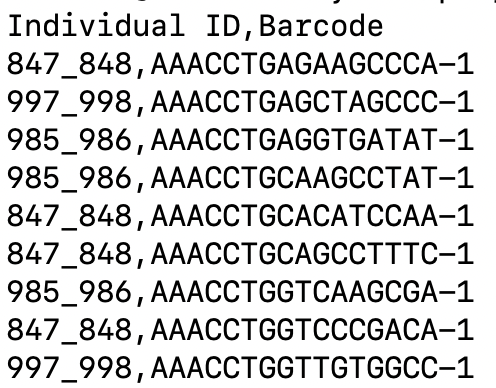

# An End-to-End Bioinformatics Pipeline for Generating Allele-specific Expression from Multiplexed Single-Cell RNA-seq data

Allele-specific expression (ASE) analysis investigates the differential expression of two alleles of the same gene in diploid organisms. ASE provides critical insights into diverse regulatory mechanisms, including cis-regulatory variation, epigenetic modifications, and nonsense-mediated decay. However, existing bioinformatics pipelines for deriving single-cell ASE counts vary significantly across studies. As a result, researchers often expend considerable time and effort on repetitive and technically complex programming tasks to implement these pipelines. To alleviate—and potentially eliminate—this burden, we propose a highly user-friendly bioinformatics pipeline that automatically processes raw sequencing data from multiple individuals and generates single-cell ASE counts for each individual. With minimal user input, the pipeline performs all necessary steps, streamlining the workflow and significantly reducing the manual workload for researchers.

Part of our pipeline is based on [SALSA pipline](https://github.com/p4rkerw/SALSA). Thanks for their excellent work. 

## Part 1: Overview of the Whole Pipeline
### 1.2 Bioinformatics Pipeline
Our pipeline is built upon the SALSA pipeline, an excellent bioinformatics workflow for scASE analysis. However, our pipeline introduces two key improvements:

1. The original SALSA pipeline is designed for allele-specific expression analysis of a single individual and cannot be directly applied to mulitiplexed scRNA-seq samples. In contrast, our pipeline is specifically designed for large-scale single-cell datasets with multiple individuals, following the structure described in Section 1.1. The SALSA pipeline is integrated as a core component within our broader framework.

2. Our pipeline offers an accessible, streamlined solution for deriving ASE counts directly from GEO websites.

Our pipeline consists of seven main steps. For each step, users only need to customize file paths according to their data and then wait for the process to complete.

In Section 2, we will explain the idea of DAESC-P and the required preparation:

- In Section 2.1, we will explain the struture of the scRNA-seq data DAESC-P is suitable to process. 

- In Section 2.2, we will explain the requirement of DAESC-P. 

- In Section 2.3, we will show how to download DAESC-P from Zenodo.

- In Section 2.4&2.5, we will explain how to prepare input files for DAESC-P.

Once the preparation is complete, we proceed to the main pipeline in Section 3:

- In Section 3.1, we process the input cellbarcode file and do some data preparation. Downloading raw SRA files from GEO websites is optional at this step. If you download them at this step, you do not need to download them again in Section 3.2 
- In Section 3.2, we download raw .sra files from GEO websites according to user input file (the pipeline will automatically skill this step if the SRA files have already downloaded in the above step). After downloading, we convert .sra files to FASTQ files and split them into smaller FASTQ files according to different individuals. 
- In Section 3.3, we recombine FASTQ files from the same individual but differenr samples. And then we do the alignemnt by Cellranger and model the single-cell ASE counts by modified SALSA pipeline. 


<span style="color:red">(A schematics figrues)</span>

## Part 2: Environment and Data Preparation 
### 2.1 Structure of Single-cell Data
Before discussing the pipeline, we first need to understand the general structure of the data. Multiplexing is a technique to sequence multiple samples in a single experimental run, and is commonly used to reduce costs and identify artifacts. The raw reads are typically saved in multiple pools, each of which is comprised of a small number of individuals. Within each pool, the library may be further divided and sequenced in multiple experimental runs.

We use the [OneK1K dataset](https://www.ncbi.nlm.nih.gov/geo/query/acc.cgi?acc=GSE196830) (GSE196830) as an example. In this study, single-cell RNA-seq data were collected for peripheral blood mononuclear cells (PBMCs). This dataset contains a total of 77 pools, each consisting of multiple individuals (12, 14, or 16 per pool). For each pool, data from 20 runs are available. The different runs comes from the same pools actually contains the reads of the same individuals. 

For example, we show SRR18029350 and SRR18029351 from Pool 11, SRR18029370 from Pool 12. This is the general structure of single-cell sequencing data collected from multiple individuals. Our pipeline is specifically designed to process such data and produce allele-specific read counts for each individual.

```
SRR18029350 (834_835, 835_836, 836_837, 845_846, 846_847, 847_848, 848_849,849_850, 850_851, 851_852, 985_986, 989_990, 990_991, 997_998)

	
SRR18029351 (834_835, 835_836, 836_837, 845_846, 846_847, 847_848, 848_849,849_850, 850_851, 851_852, 985_986, 989_990, 990_991, 997_998)

SRR18029370 (810_811, 811_812, 812_813, 852_853, 986_987, 991_992, 992_993, 993_994, 994_995, 995_996, 996_997, 998_999, 999_1000)

```

we will use the [OneK1K dataset](https://www.ncbi.nlm.nih.gov/geo/query/acc.cgi?acc=GSE196830) (GSE196830) as an example. We will show how to use our pipeline to process the **Pool11** and get the single-cell ASE for three individuals (847_848, 985_986, 997_998). 

### 2.2 Requirement for DAESC-P
One of biggest advanatage of our pipeline is that it is an end-to-end bioinformatics pipeline for your scASE analysis. Users do not need to go through the tedious process of downloading and installing individual packages. We have prepared all packages and softwares in a compressed file. 

What you need is a server. Your server should have enough memory and disk space. For the package requirement, you only need to know how to use SRA-Toolkit and BBMap. You can use conda environment or module loading to install these packages. The name of these two package are different under different environment setting, you can load package of other names as long as we can use the commands `prefetch` for downloading .sra files, `fasterq-dump` and `splitbyname.sh` for splitting FASTQ.gz files. 

In summary, if you want to use DAESC-P, you need to prepare the following: 

- A server with sufficient memory and disk space.
- The SRA-Toolkit and BBMap. 


### 2.3 Download DAESC-P
First, create a folder on your server to save the environment and the following scASE data. Your server should have enough memory. 

```
wget -O reference_test.tar.gz "https://zenodo.org/records/15361243/files/mypipeline_2.tar.gz?download=1"

tar -xzvf reference_test.tar.gz
```

After you have run this cript, in your folder `/path/to/DAESC-P/reference_test`, the content may looks like the below. 

```
DAESC-P/
├── cellbarcodes/        # Cell barcode files (Individual ↔ Barcode mapping)
├── Data_SRR/            # Raw SRA files (SRRxxxx)
├── Data_Individuals/    # Data for each individual
├── Lists/               # Input lists (SRR list, individual list, etc.)
├── logs/                # SLURM and pipeline log files
├── reference_test/      # Reference genomes and all other necessary softwares
├── scr/                 # Core source codes
├── DAESC-P0.sh          # Step 0: environment & input preparation
├── DAESC-P1_slurm.sh    # Step 1: SRA → FASTQ + splitting (SLURM)
└── DAESC-P2_slurm.sh    # Step 2: CellRanger + ASE pipeline (SLURM)
```

**Important**: In the below, when you want to run DAESC-P, you only need to change your current path to your root path `/path/to/DAESC-P`, change these *_slurm.sh files (we will provide details below), and run the scripts. For example: `bash DAESC-P0.sh`, `sbatch DAESC-P1_slurm.sh`, and `sbatch DAESC-P2_slurm.sh`.


### 2.4 Input 1: SRR ID 
In order to use our pipeline, you need to prepare two csv files: one is a list of SRR ID (Sequence Read Archive ID) and the other is a list of cell barcodes. You can find a scRNA -seq dataset you want to analysis from Gene Expression Omnibus ([GEO](https://www.ncbi.nlm.nih.gov/geo/)) and find the corresponding SRR ID. For example, in the below we will use the [OneK1K dataset](https://www.ncbi.nlm.nih.gov/geo/query/acc.cgi?acc=GSE196830) (GSE196830), **Pool11** to get the single-cell ASE for three individuals (847_848, 985_986, 997_998). You can just create a csv file named `List_Input.txt` under the folder `/path/to/mypipeline/Lists/` by the command below: 

```
nano /path/to/mypipeline/Lists/List_Input.txt

# Content of List_Input.txt
# SRR18029350
# SRR18029351
# SRR18029352
```

### 2.5 Input 2:  Cell Barcodes 

The second required input file is a cell barcodes list. So what is a cell barcode? We can first take a look at one example: 

<div align="center">
  
</div>

The first column represents the **individual ID**, and the second column contains a short RNA sequence known as the **cell barcode** . Each individual is associated with multiple barcodes, as high-throughput RNA sequencing platforms (such as the Illumina NovaSeq 6000) typically capture thousands of cells from a single individual.

In other words, while a single experiment can capture expression profiles from millions of cells, cell barcodes are essential for identifying the individual origin of each cell. This mapping between barcodes and individuals is crucial for enabling downstream allele-specific expression analysis at the single-cell level.

Next question, how can we get cell barcodes? In this example, you do not need to download it. We have prepare it for you under the folder **cellbarcodes** .

But if you want to study other pools of OneK1K data set or your own data, here we explain how we get such cell barcodes file: you can directly download them online. For example, if you want to study Pool11, go to [the GEO websites for OneK1K Pool11](https://www.ncbi.nlm.nih.gov/geo/query/acc.cgi?acc=GSM5899883). Go to the **Supplementary file** and download the file named `GSM5899883_OneK1K_scRNA_Sample11_Individual_Barcodes.csv.gz`.

You can repeat the same steps for other pools. Similarly, you can use this approach to download cell barcodes from other datasets. We recommend you to put the cell barcode list file undet the folder **cellbarcodes** under the root path of DAESC-P. And we recommend you to put the SRR list under the folder **Lists** under the root path of DAESC-P. We have already prepared the example cell barcode list and SRR list in the pipeline after you have downloaded the pipeline.

But **remember**: ALL SRRXXXX data should share the same cell barcodes list. In some datsets, different SRRXXXX may have different cell barcodes. In this case, you need to run DAESC-P separately one time for all SRRXXXX data under the same cellbarcodes list. 


## Part 3: Get Multiple Individual ASE Count
If you have download all necessary packages and prepare two input files, our scripts can be easily used to generate single-cell ASE counts. Our pipeline has 3 steps. 

You need to change your current path to your root path `/path/to/DAESC-P` .

### 3.1 Data Preparation

```
bash DAESC-P0.sh \
    root_path=/path/to/DAESC-P \
    cellbarcodes_file=/path/to/DAESC-P/cellbarcodes/Cell_Barcode.csv \
    list_input_file=/path/to/DAESC-P/Lists/List_Input.txt \
    download_srr=True
```

Arguments:
- root_path: The root path of DAESC-P.
- cellbarcodes_file: The path of your cell barcodes file.
- list_input_file: The path of user input file containing only the SRR ID.
- download_srr: Whether to download raw SRA files from GEO websites. If you have downloaded SRA files or you want to download in the next step, set it as False.

Here we explain the main steps of the argument `download_srr`. If you set it True, the script will download raw SRA files from GEO websites according to your user input file. The time will be long if you have many SRA files or you need to download large SRA files. But the advantage is that you do not need to worry about the firewall configuration on the server. Since the firewall configuration on the server may block outbound connections required by SRA Tools (prefetch, fasterq-dump), which prevents downloading datasets from GEO/NCBI. The problem does not occur on the login node, but appears when the same commands are executed on SLURM compute nodes. If you are sure that your server do not have such problem, you can set it as False and download SRA files by SLURM in the next step. It is very convenient and time-saving.

### 3.2 Split FASTQ files 
I will show the scripts **DAESC-P1_slurm.sh**. By this scipt, we can download raw SRA files from GEO websites according to user input file, convert .sra files to FASTQ files and split them into smaller FASTQ files according to different individuals. The script is designed to be run on a SLURM-managed high-performance computing cluster, allowing for efficient parallel processing of multiple tasks. Each task in the SLURM array processes a SRR ID.

You can find the script under the folder DAESC-P after you have download our pipeline. You only need to change some basic configuration according to your project setup.

```
#!/bin/bash
#SBATCH --job-name=daescp1
#SBATCH --output=logs/daescp1_%A_%a.out
#SBATCH --error=logs/daescp1_%A_%a.out
#SBATCH --array=1-10%5
#SBATCH --ntasks=1
#SBATCH --cpus-per-task=4
#SBATCH --mem=32G               # Increased memory for FASTQ splitting operations
#SBATCH --time=04:00:00         # Increased time for large SRA files

# =========================
# Basic Configuration (Modify these paths according to your project setup)
# =========================
ROOT_PATH="/path/to/DAESC-P"
TXT_INPUT="${ROOT_PATH}/Lists/List_Input.txt"
CELLBARCODES_FILE="${ROOT_PATH}/cellbarcodes/Sample11_three.csv"

ml purge
ml GCC/12.3.0 OpenMPI/4.1.5
module load SRA-Toolkit/3.0.10   # Required for downloading SRA files
module load BBMap/39.19        # Required for FASTQ file processing 

# =========================
# Execute Processing Script (Do not modify below this line)
# =========================
LINE_NUMBER="${SLURM_ARRAY_TASK_ID}"
mkdir -p "${ROOT_PATH}/logs"
cd "${ROOT_PATH}" || exit 1
bash ${ROOT_PATH}/DAESC-P1.sh \
    root_path="${ROOT_PATH}" \
    txt_input="${TXT_INPUT}" \
    line_number="${LINE_NUMBER}" \
    cellbarcodes_file="${CELLBARCODES_FILE}"
```

These are the parts of the code that need to be modified： 
- the SLURM job configuration：Chanage it according to your server setting. Please make sure change the array according to the number of SRR id. In our example, we need to download and process 10 SRR, so we set it as `--array=1-10%5`. If you have 20 RUNs, you need to set it as `--array=1-20%5`.
- Basic Configuration: Change the `ROOT_PATH`, `TXT_INPUT`, and `CELLBARCODES_FILE` according to your own path. ROOT_PATH is the root path of DAESC-P folder (ex. /path/to/DAESC-P). TXT_INPUT is the path of your user input file (ex. /path/to/DAESC-P/Lists/List_Input.txt), which contains the SRR ID . CELLBARCODES_FILE is the path of your cell barcodes file (ex. /path/to/DAESC-P/cellbarcodes/Sample11_three.csv).
- Module loading: Make sure to load SRA-Toolkit and BBMap. You can change the module loading part according to your server setting, as long as we can use the commands `prefetch`, `fasterq-dump` and `splitbyname.sh`. For example, you if you conda envvironment rather than module loading, you can delete the `module load` part and use `conda activate your_env` instead.

### 3.3 Single-Cell ASE Modeling

The script **DAESC-P2_slurm.sh** is designed to recombine FASTQ files from the same individual but different samples, and then perform alignment by Cellranger and model the single-cell ASE counts by modified SALSA pipeline. The script is also designed to be run on a SLURM-managed high-performance computing cluster, allowing for efficient parallel processing of multiple tasks. Each task in the SLURM array processes an individual.

```
#!/bin/bash
#SBATCH --job-name=daescp2
#SBATCH --output=logs/daescp2_%A_%a.out
#SBATCH --error=logs/daescp2_%A_%a.out
#SBATCH --array=1-3%3          
#SBATCH --ntasks=1
#SBATCH --cpus-per-task=8
#SBATCH --mem=360G
#SBATCH --time=12:00:00    

# =========================
# Basic Configuration (Modify these paths according to your project setup)
# =========================
ROOT_PATH="/scratch/user/tfcui2025/DAESC/mypipeline_2"

ml purge
ml GCC/12.3.0 OpenMPI/4.1.5
module load Singularity/3.10.2 

# =========================
# Execute Processing Script (Do not modify below this line)
# =========================
TXT_INDIVIDUALS="${ROOT_PATH}/Lists/List_Individuals.txt"
LINE_NUMBER="${SLURM_ARRAY_TASK_ID}"
mkdir -p "${ROOT_PATH}/logs"
cd "${ROOT_PATH}" || exit 1
line=$(sed -n "${LINE_NUMBER}p" "$TXT_INDIVIDUALS")
Individual_ID=$(echo "$line" | awk '{print $1}')
CHR_STRING=$(echo "$line" | sed -E 's/^[^ ]+ \(([^)]+)\)/\1/')
bash ${ROOT_PATH}/scr/DAESC-P2.sh "${Individual_ID}" "${CHR_STRING}"
```


These are the parts of the code that need to be modified： 
- the SLURM job configuration：Chanage it according to your server setting. Please make sure change the array according to the number of individuals. In our example, we need to model scASE count for 3 individuals, so we set it as `--array=1-3%3`. 
- Basic Configuration: Change the `ROOT_PATH` according to your own path. ROOT_PATH is the root path of DAESC-P folder (ex. /path/to/DAESC-P). 
- Module loading: Make sure to load Singularity. You can change the module loading part according to your server setting. We have already propvied the Singularity container in DAESC-P, but you need to make sure you are able to use the Singularity container on your server.

### 3.4 Some trips 

- DAESC-P can process multiple SRR data at the same time, but we assume all SRR data share the same cell barcodes list. You can only give one cell barcode list to DAESC-P at one time. If you have multiple SRR data with different cell barcodes, you need to seprate different SRR data into different groups and run DAESC-P separately for each group. The SRR data in the same group should share the same cell barcodes list.

- DAESC-P2_slurm.sh file needs to process the most intensive computational tasks, including Cellranger alignment and modified SALSA pipeline. You need to make sure you have enough allocate memory and time for this step. For example, if you need to process Onek1k dataset, you need to allocate at least 250 G memory for each task at this step. 

- If you do not need to worry about the firewall configuration on the server, we recommend you to download SRA files by DAESC-P1_slurm.sh. You do not need to wait for it. Give enough time for DAESC-P1_slurm.sh and DAESC-P2_slurm.sh. 

