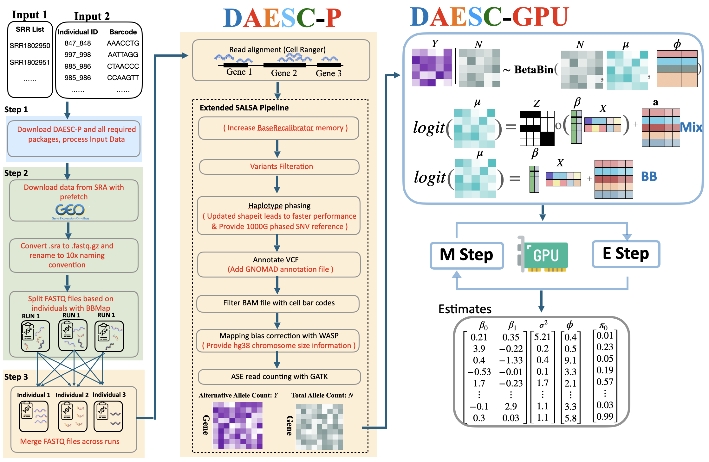
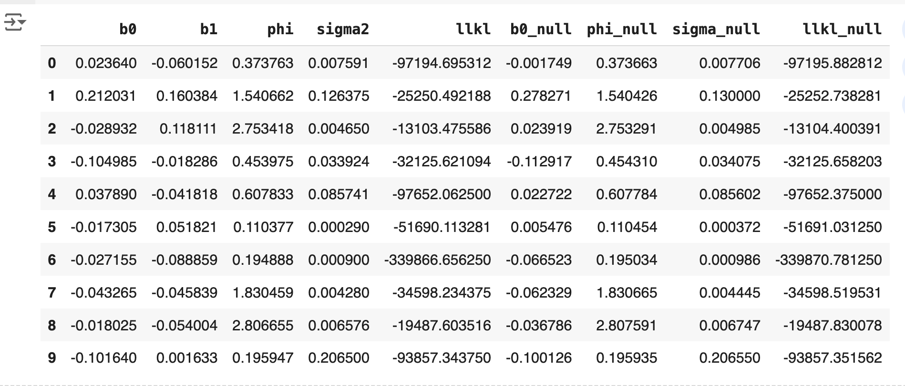
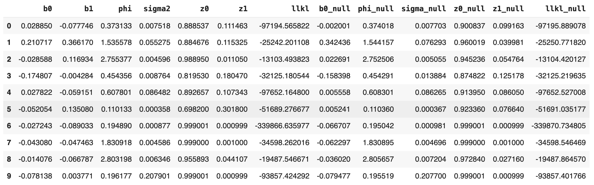

# DAESC-GPU: A GPU-powered scalable software for single-cell allele-specific expression analysis 

Single-cell RNA sequencing (scRNA-seq) is a transformative technology for unraveling the roles specific cell types play in disease pathology. A critical step toward this goal is identifying genes that exhibit differential expression across cell types.

Differential Allelic Expression using Single-Cell data ([DAESC](https://github.com/gqi/DAESC/tree/main)) is an advanced statistical method that provides robust Type I error control and improved statistical power compared to other state-of-the-art approaches. However, the original DAESC implementation in R faces computational limitations, especially when analyzing large datasets containing millions of cells.

We introduce DAESC-GPU, a fast, scalable re-implementation of DAESC that leverages graphics processing units (GPUs) for computational acceleration. Unlike the original DAESC approach, which analyzes one gene at a time, DAESC-GPU simultaneously processes all genes using efficient matrix operations. These operations benefit significantly from GPU-enabled parallel computation, dramatically reducing runtime.

The DAESC framework includes two core methods: DAESC-BB and DAESC-Mix. DAESC-BB employs a beta-binomial regression model incorporating individual-specific random effects to manage sample correlation arising from multiple cells per individual. DAESC-Mix extends this approach by implicitly modeling haplotype phasing. Correspondingly, our GPU-accelerated software contains two analogous components: DAESC-BB-GPU and DAESC-Mix-GPU.

## Model


We present a schematic illustration of DAESC-Mix-GPU. Starting with data from a high-throughput sequencer, we generate count matrices (Y and N), where rows represent variants and columns represent cells. The first section of the figure depicts the statistical model for a single variant, while the second section demonstrates how DAESC-GPU employs matrix operations to analyze multiple variants simultaneously. Finally, the bottom section illustrates the execution of the entire variational EM algorithm on the GPU using CuPy, culminating in the generation of all estimates provided by DAESC-Mix-GPU.

## Install 
DAESC-GPU significantly accelerates computational speed through GPU parallelization. To use DAESC-GPU, you need access to an NVIDIA GPU. Here are three typical ways to achieve GPU access:

- Renting GPUs online via cloud services (e.g., Amazon EC2)

- Utilizing existing GPU resources at your institution or laboratory

- Accessing GPUs via affordable or free platforms like Google Colab or Kaggle

Below, we demonstrate installing and using our software on Google Colab, which provides free access to T4 GPUs for the first 10 hours, with more powerful GPUs such as A100 available for a small fee.

You can download and install our package on Gogle Colab: 
```
!pip install git+https://github.com/ITCUI-XJTLU/DAESC-GPU.git
```

## Example 
DAESC-GPU provide two functions: `daesc_gpu.daesc_bb_gpu()` `daesc_gpu.daesc_mix_gpu()` for the two components. Both of two functions need four parameters. 

- ynidx_data (Required): A NumPy matrix structured to represent allele counts, individual labels, and covariates. For analyzing n genes/variants across m cells, this matrix must have (2n + 2) rows and m columns:

    - Rows 1 to n: Alternative allele read counts for each gene/variant and cell.

    - Rows (n+1) to 2n: Total allele read counts, corresponding one-to-one with the alternative counts above.

    - Row (2n + 1): Individual labels for each cell, represented as integer identifiers (e.g., 0, 1, 2, ...).

    - Row (2n + 2): Covariate values (x_ij) for each cell (currently a scalar), such as cell types, psudome time, continuous cell states

```
    ynidx_data matrix :
    [[ 3.  6.  9.  2.  5.]  # three alternative allele read counts (n rows)
    [ 4.  7.  1.  8.  3.]
    [ 8.  2.  4.  6.  7.]
    [12. 15. 14. 10. 12.]  # three total allele read counts (n rows)
    [ 8. 10.  8. 14. 10.]
    [14.  7. 10. 12. 14.]
    [ 1.  2.  1.  0.  2.]  # inidividual (1 row)
    [ 0.3 0.8 0.5 0.2 0.9]] # covariate (1 row)
```

- part (Optional, default=1): Specifies the number of parts to divide large datasets into, enabling sequential GPU processing to manage GPU memory limitations.

- num_iteration (Optional, default=50): Maximum number of iterations for the Expectation-Maximization (EM) algorithm.

- min_iter (Optional, default=20): Minimum number of EM iterations guaranteed for each gene before convergence criteria are checked.

- max_optim (Optional, default=10): Maximum number of iterations for the customized multi-objective BFGS optimization algorithm. Increasing this value might improve optimization but at the cost of longer runtime.

- max_line (Optional, default=15): Maximum iterations allowed for line search within each BFGS optimization step. Adjusting this can affect the accuracy and runtime of optimization,like max_optim. 

In the below, we will use a example data (10 genes and 30,474 cells) to show the usage of DAESC-BB-GPU(A100):

```
import daesc_gpu
import cupy

example_data = daesc_gpu.load_example_data()
my_bb_results = daesc_gpu.daesc_bb_gpu(example_data)
```

It takes 1.01 minutes to finish the trainning. During trainning, we can get the runtime for each E-M iteration. After trainning, you can get the estimates (my_bb_results ):



The use of DAESC-Mix-GPU (`daesc_gpu.daesc_mix_gpu()`) is the same. 

```
my_mix_results = daesc_gpu.daesc_mix_gpu(example_data)
```

It takes 1.57 minutes to finish the trainning. During trainning, we can get the runtime for each E-M iteration. After trainning, you can get the estimates (my_mix_results ):




## Reference
Our manuscipt will be finished sooner. 

## Maintainer
Tengfei Cui (tfcui23@uw.edu)

