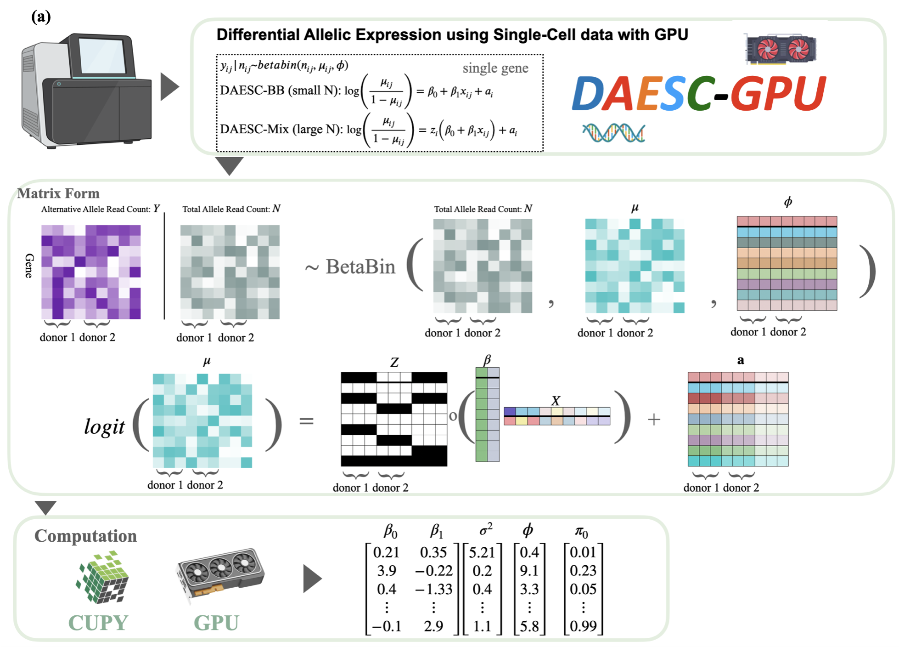

# DAESC-GPU: A GPU-powered scalable software for single-cell allele-specific expression analysis 

Single-cell RNA sequencing is an exciting technology that promises to improve our understanding of the roles that specific cell types play in disease pathology. Understanding which genes are differentially expressed between cell types is crucial to achieving this goal.

Differential Allelic Expression using Single-Cell data ([DAESC](https://github.com/gqi/DAESC/tree/main)) is a powerful new method with robust
Type I error control and improved power compared to other state-of-the-art statistical methods. However, the computational efficiency of the DAESC R package is suboptimal, making it challenging to analyze datasets with a large number of cells (e.g., >1 million).

We propose DAESC-GPU, a fast and scalable re-implementation of DAESC using graphics processing units (GPUs). In contrast to the DAESC approach of analyzing one gene at a time, DAESC-GPU analyzes all genes simultaneously using large matrix operations. These operations are dramatically accelerated using GPUs through massive parallel computing. 

DAESC comprises two components: DAESC-BB and DAESC-Mix. DAESC-BB is a beta-binomial regression model that incorporates individual-specific random effects to account for the sample repeat structure resulting from multiple cells per individual. DAESC-Mix extends DAESC-BB by incorporating implicit haplotype phasing. Correspondingly, our DAESC-GPU framework also consists of two components: DAESC-BB-GPU and DAESC-Mix-GPU.

## Model


We present a schematic illustration of DAESC-Mix-GPU. Starting with data from a high-throughput sequencer, we generate count matrices (Y and N), where rows represent variants and columns represent cells. The first section of the figure depicts the statistical model for a single variant, while the second section demonstrates how DAESC-GPU employs matrix operations to analyze multiple variants simultaneously. Finally, the bottom section illustrates the execution of the entire variational EM algorithm on the GPU using CuPy, culminating in the generation of all estimates provided by DAESC-Mix-GPU.

## Install 
One of the most important features of our software is its use of GPUs to accelerate all computations. To utilize DAESC-GPU, you need access to an NVIDIA GPU. There are three main ways to achieve this. First, you can rent a GPU online through platforms such as Amazon EC2. Second, you may already own a GPU or have access to one through your institution or organization. Third, if neither of these options is feasible, you can still access GPUs via free or low-cost online platforms like Google Colab or Kaggle. Below, we demonstrate how to use our software on Google Colab. The process is similar for other platforms. On Google Colab, you can access a T4 GPU for free, and by paying a small fee, you can use a more powerful GPU, such as the A100.

You can download and install our package on Gogle Colab: 
```
!pip install git+https://github.com/ITCUI-XJTLU/DAESC-GPU.git
```
## Example 
DAESC-GPU provide two functions: `daesc_gpu.daesc_bb_gpu()` `daesc_gpu.daesc_mix_gpu()` for the two components. Both of two functions need four parameters. 

- ynidx_data: (Required) A count matrix. For example, to analyze 
n genes/variants across m cells, this parameter should be a NumPy matrix with (2n+2) rows and m columns. The first  n rows represent the alternative allele read counts for m genes/variants, while rows (n+1) to 2n represent the total allele read counts for the same genes/variants. The (2n+1)-th row indicates the individual associated with each cell, where each individual is represented as an integer (e.g., 0, 1, 2, ...). The final row contains the covariate (x_ij) for each cell and gene, as illustrated in the schematic figure. In the current version, the covariate is represented as a scalar. Future versions of the software may extend this functionality to accept vectors as covariates. Below is an example: 

```
    ynidx_data matrix :
    [[ 3.  6.  9.  2.  5.]  # three alternative allele read counts (n rows)
    [ 4.  7.  1.  8.  3.]
    [ 8.  2.  4.  6.  7.]
    [12. 15. 14. 10. 12.]  # three total allele read counts (n rows)
    [ 8. 10.  8. 14. 10.]
    [14.  7. 10. 12. 14.]
    [ 1.  2.  1.  0.  2.]  # inidividual (1 row)
    [ 0.3 0.8 0.5 0.2 0.9]] # covariate (1 row)
```

- part: (Optional, default=1) Specifies the number of equal parts into which the data should be split for sequential training when using DAESC-GPU. This parameter is particularly useful for handling large datasets, as GPU memory is limited (e.g., 15GB RAM for T4 GPUs and 40GB RAM for A100 GPUs). When the dataset is too large to fit into the GPU memory, splitting the data into smaller parts, each containing an equal number of genes, allows for efficient analysis. The software processes each part sequentially to ensure memory limitations are respected.

- num_iteration: (Optional, default=50) Specifies the maximum number of E-M iterations for analyzing the data. Since the DAESC model uses the E-M algorithm to estimate unknown parameters, this parameter sets an upper limit on the number of iterations performed during the fitting process.

-  min_iter: (Optional, default=20) Specifies the minimum number of E-M iterations for all genes. For instance, if this parameter is set to 20, all data will be fitted through the first 20 iterations. Afterward, the change in log-likelihood is evaluated. If the changes in log-likelihood for certain genes are negligible, these genes are considered well-fitted, and their results are recorded. Such genes are excluded from further iterations, reducing runtime and improving computational efficiency.

- max_optim (Optinal, default=10): Specifies the maximum iteration number of our designed BFGS optimizers for multiple objectives. The defaul number is 10. If you inrease this number, it is more likely for the optimizer to find the optimal points. But it will increase the runtime. We found 10 is enough for most cases.  

- max_line  (Optinal, default=15): Sepecifies the maximum interation for line search in each customized BFGS algotirhm. In the algorithm, we need to use line search to find the appropriate step lengths for each genes. If you inrease this number, it is more likely for the optimizer to find the optimal points. But it will increase the runtime. We found 15 is enough for most cases.  

In the below, we will use a example data (10 genes and 30,474 cells) to show the usage of DAESC-BB-GPU(A100):

```
import daesc_gpu
import cupy

example_data = daesc_gpu.load_example_data()
my_bb_results = daesc_gpu.daesc_bb_gpu(example_data)
```

It takes 1.01 minutes to finish the trainning. During trainning, we can get the runtime for each E-M iteration. After trainning, you can get the estimates (my_bb_results ):


The use of DAESC-Mix-GPU (`daesc_gpu.daesc_mix_gpu()`) is the same. 

```
my_mix_results = daesc_gpu.daesc_mix_gpu(example_data)
```

It takes 1.57 minutes to finish the trainning. During trainning, we can get the runtime for each E-M iteration. After trainning, you can get the estimates (my_mix_results ):


## Reference
Our manuscipt will be finished sooner. 

## Maintainer
Tengfei Cui (tfcui23@uw.edu)

