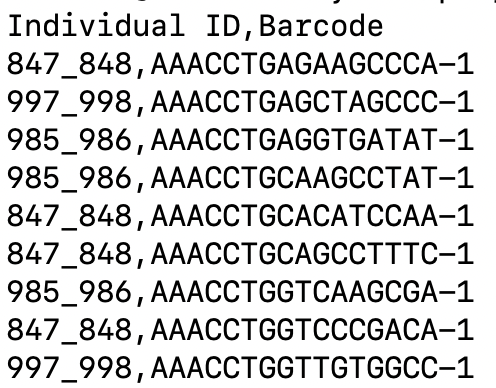
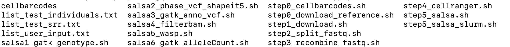
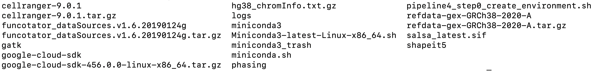

# An End-to-End Bioinformatics Pipeline for Generating Allele-specific Expression from Multiplexed Single-Cell RNA-seq data

Allele-specific expression (ASE) analysis investigates the differential expression of two alleles of the same gene in diploid organisms. ASE provides critical insights into diverse regulatory mechanisms, including cis-regulatory variation, epigenetic modifications, and nonsense-mediated decay. However, existing bioinformatics pipelines for deriving single-cell ASE counts vary significantly across studies. As a result, researchers often expend considerable time and effort on repetitive and technically complex programming tasks to implement these pipelines. To alleviate—and potentially eliminate—this burden, we propose a highly user-friendly bioinformatics pipeline that automatically processes raw sequencing data from multiple individuals and generates single-cell ASE counts for each individual. With minimal user input, the pipeline performs all necessary steps, streamlining the workflow and significantly reducing the manual workload for researchers.

Part of our pipeline is based on [SALSA pipline](https://github.com/p4rkerw/SALSA). Thanks for their excellent work. 

## Part 1: Overview of the Whole Pipeline
### 1.1 Structure of Single-cell Data
Before discussing the pipeline, we first need to understand the general structure of the data. Multiplexing is a technique to sequence multiple samples in a single experimental run, and is commonly used to reduce costs and identify artifacts. The raw reads are typically saved in multiple pools, each of which is comprised of a small number of individuals. Within each pool, the library may be further divided and sequenced in multiple experimental runs.

We use the [OneK1K dataset](https://www.ncbi.nlm.nih.gov/geo/query/acc.cgi?acc=GSE196830) (GSE196830) as an example. In this study, single-cell RNA-seq data were collected for peripheral blood mononuclear cells (PBMCs). This dataset contains a total of 77 pools, each consisting of multiple individuals (12, 14, or 16 per pool). For each pool, data from 20 runs are available.

This is the general structure of single-cell sequencing data collected from multiple individuals. Our pipeline is specifically designed to process such data and produce allele-specific read counts for each individual.

<span style="color:red">(figrues for the structure)</span>

### 1.2 Bioinformatics Pipeline
Our pipeline is built upon the SALSA pipeline, an excellent bioinformatics workflow for scASE analysis. However, our pipeline introduces two key improvements:

1. The original SALSA pipeline is designed for allele-specific expression analysis of a single individual and cannot be directly applied to mulitiplexed scRNA-seq samples. In contrast, our pipeline is specifically designed for large-scale single-cell datasets with multiple individuals, following the structure described in Section 1.1. The SALSA pipeline is integrated as a core component within our broader framework.

2. Our pipeline is user-friendly. It offers an accessible, streamlined solution for deriving ASE counts directly from raw RNA sequencing data.

Our pipeline consists of seven main steps. For each step, users only need to customize file paths according to their data and then wait for the process to complete.

In Section 2, we describe the required preparation:

- In Section 2.1, we prepare cell barcodes for each individual.

- In Section 2.2, we download the all required softwares and packages.

Once the preparation is complete, we proceed to the main pipeline in Section 3:

- In Section 3.1, we download the data from GEO. After this step, we obtain three FASTQ files (read1, read2, and index) for each run.

- In Section 3.2, we split the FASTQ files by individual.

- In Section 3.3, we recombine reads belonging to the same individual across different runs.

- In Section 3.4, we use Cell Ranger to align each individual’s data to the reference genome.

- Finally, in Section 3.5, we obtain single-cell ASE counts. This step largely follows the SALSA pipeline with some modifications to accommodate multi-individual data.

<span style="color:red">(A schematics figrues)</span>

## Part 2: Environment and Data Preparation 
In this document, we will use the [OneK1K dataset](https://www.ncbi.nlm.nih.gov/geo/query/acc.cgi?acc=GSE196830) (GSE196830) as an example. We will show how to use our pipeline to process the **Pool11** and get the single-cell ASE for three individuals (847_848, 985_986, 997_998). 

We have combined all dependencies into a single .zip file. Users will not need to go through the time-consuming process of installing individual packages.

### 2.1 Cell Barcodes 
The first step is to download cell barcodes. So what is a cell barcode? We can first take a look at one example: 

<div align="center">
  
</div>

The first column represents the **individual ID**, and the second column contains a short RNA sequence known as the **cell barcode** . Each individual is associated with multiple barcodes, as high-throughput RNA sequencing platforms (such as the Illumina NovaSeq 6000) typically capture thousands of cells from a single individual.

In other words, while a single experiment can capture expression profiles from millions of cells, cell barcodes are essential for identifying the individual origin of each cell. This mapping between barcodes and individuals is crucial for enabling downstream allele-specific expression analysis at the single-cell level.

Next question, how can we get cell barcodes? In this example, you do not need to download it. We have prepare it for you under the folder **cellbarcodes** . Now, on your server, create a folder for our project, and run the command to download our example data and all scripts: 

```
wget -O mypipeline.zip "https://zenodo.org/records/15273319/files/mypipeline.zip?download=1"
unzip mypipeline.zip
```

In the below, we will finish all process in this folder `/path/to/root/mypipeline`.  We can take a look at the contents of this folder: 

<div align="center">
  
</div>

The example cell barcode files are saved in the folder `./mypipeline/cellbarcodes`. Under the folder of `mypipeline`, there are all scripts of our pipeline. 

**But if you want to study other pools of OneK1K data set or your own data, here we explain how we get such cell barcodes file**: you can directly download them online. For example, if you want to study Pool11, go to [the GEO websites for OneK1K Pool11](https://www.ncbi.nlm.nih.gov/geo/query/acc.cgi?acc=GSM5899883). Go to the **Supplementary file** and download the file named `GSM5899883_OneK1K_scRNA_Sample11_Individual_Barcodes.csv.gz`. You need to decompress it by the command: 

```
gunzip GSM5899883_OneK1K_scRNA_Sample11_Individual_Barcodes.csv.gz

# rename the file, because the old name is too long
mv GSM5899883_OneK1K_scRNA_Sample11_Individual_Barcodes.csv Sample11_three.csv 
```

You can repeat the same steps for other pools. Similarly, you can use this approach to download cell barcodes from other datasets. But **remember**: You only need to download cell barcodes once per pool, since the set of individuals remains the same across different runs within the same pool. Upload the downloaded file to the folder: `/home/user/mypipeline/cellbarcodes` . So you can find the csv file at the path: `/home/user/mypipeline/cellbarcodes/Sample11_three.csv` . 

Now, you need to create a `list_user_input.txt` file under the assumed root path `/home/user/mypipeline/` by the commnad below,and copy the content.  

```
nano list_user_input.txt

# the content of list_user_input.txt
# Sample11 SRR18029350 /home/user/mypipeline/cellbarcodes/Sample11_three.csv
# Sample11 SRR18029351 /home/user/mypipeline/cellbarcodes/Sample11_three.csv
# Sample11 SRR18029352 /home/user/mypipeline/cellbarcodes/Sample11_three.csv
# Sample11 SRR18029353 /home/user/mypipeline/cellbarcodes/Sample11_three.csv
# Sample11 SRR18029354 /home/user/mypipeline/cellbarcodes/Sample11_three.csv
# Sample11 SRR18029355 /home/user/mypipeline/cellbarcodes/Sample11_three.csv
# Sample11 SRR18029356 /home/user/mypipeline/cellbarcodes/Sample11_three.csv
# Sample11 SRR18029357 /home/user/mypipeline/cellbarcodes/Sample11_three.csv
# Sample11 SRR18029358 /home/user/mypipeline/cellbarcodes/Sample11_three.csv
# Sample11 SRR18029359 /home/user/mypipeline/cellbarcodes/Sample11_three.csv
```

You can also modify the file for your own data. The first column indicates the pool number. In this project, we focus on Pool 11 of the OneK1K dataset, so we set the first column to Sample11. You can also use names like pool11 or number11—any consistent naming convention is fine. The second column specifies the RUN number you want to download. In OneK1K Pool 11, there are 20 RUNs in total. In this example, we only downloaded the first 10. If you want to use this pipeline for your own data, you need to know the SRR number (Sequence Read Archive ID) of your dataset, which can be easily found on the GEO website. The third column is the path to the cell barcode file for the pool. Since each pool has only one associated barcode file, the values in this column are the same across rows.

Then we need to split the csv file into several csv files according to different individuals. Run the following command. You may need to change the path to your own path: 

```
# 5-10 seconds
./step0_cellbarcodes.sh list_file=./list_user_input.txt root_path=/home/user/mypipeline
```

The script will also generate two new files under your root path: 

```
/path/to/mypipeline/list_test_srr.txt
/path/to/mypipeline/list_test_individuals.txt
```

These files will be used in Step 3.2 and 3.3.

### 2.2 Create Environment
One of biggest advanatage of our pipeline is that it is easy to use. Users do not need to go through the tedious process of downloading and installing individual packages. We have prepared all packages and softwares in a compressed file. Follow the instructions below to access it. 

**First,  make sure you are at the folder `./mypipeline`; otherwise, use the command `cd ./path/to/mypipeline`**. This is step is very important to run the pipeline sucessfully.  

```
# it usually take several hours to download and unzip the files
wget -O reference_test.tar.gz "https://zenodo.org/records/15252609/files/reference_test.tar.gz?download=1"
tar -xzvf reference_test.tar.gz

# if you do not want to wait, please use our script so that you can run the command on SLURM
# The whole process will take about 5 hours to finish. Hope you can wait for it. Because you do not need to do anything to deal with environment but waiting. 
sbatch \
  --job-name=dl_ref \
  --output=logs/dl_ref_%j.out \
  --error=logs/dl_ref_%j.out \
  --partition=your_partition \
  --ntasks=1 \
  --cpus-per-task=1 \
  --mem=100G \
  --time=10:00:00 \
  --wrap="bash step0_download_reference.sh"
```

After you have run this cript, in your folder `/home/user/mypipeline/reference_test`, the content may looks like: 

<div align="center">
  
</div>

We’ve completed all the preparation steps.

## Part 3: Get Multiple Individual ASE Count
If you have download all necessary packages and prepare barcodes files, our scripts can be easily used to generate single-cell ASE counts. Our pipeline has 5 steps. 

### 3.1 Download .SRA Files

```
sbatch \
  --job-name=dl_sra \
  --output=logs/dl_sra_%A_%a.out \
  --error=logs/dl_sra_%A_%a.out \
  --array=1-10 \
  --cpus-per-task=2 \
  --mem=8G \
  --time=05:00:00 \
  --partition=your_partition \
  --wrap="bash pipeline4_step0_download.sh \
    root_path=/path/to/mypipeline \
    txt_1=./list_user_input.txt \
    line_number=\${SLURM_ARRAY_TASK_ID}"
```

Here we explain the parameters of the second command:

Required: 
- job-name: the job name of SLURM 
- output, error: log file
- array: how many array you want to use. It depends on the SRR files. For example, if you want to download 10 .sra files, then there are 10 lines in the `list_user_input.txt`, so you need to use 10 array, 1-10
- cpus-per-task: the number of CPUs for each task
- mem: the number of memory per task 
- time: the longest runtime of scripts
- partition: your computing resource 
- root_path: your working dictionary. In this document, at first, we assume we want to save all data and results under the path: `/path/to/mypipeline/`

Optional: 
- txt_1: the path of srr list file `list_user_input.txt`. If you run the script `pipeline4_step0_cellbarcodes.sh` before and your current path is under `/path/to/mypipeline/`, then this file will automated to be saved to the path `/path/to/mypipeline`, you do not need to change this parameter. 
- line_number: if you use SLURM, you do not need to change this. If you use an interactive interface, then this number choose which SRR file you want to download by this script. For example, if line_number=1, then the script will automatically download the .sra file in your first line of `list_user_input.txt`. 


### 3.2 Split FASTQ Files 
In this section, we need to split FASTQ files into smaller parts according to different individuals. Because the FASTQ file from one run inlcude multiple individuals' reads. 

```
# If you want to run this script in an interactive interface
bash pipeline4_step1_split_fastq.sh \
  conda_activate_cmd=source*/home/user/mypipeline/miniconda3/etc/profile.d/conda.sh \
  root_path=/home/user/mypipeline \
  txt_1=/home/user/mypipeline/list_test_srr.txt \
  barcodes_dir=/home/user/mypipeline/cellbarcodes \
  line_number=1

# if you want to run it on SLURM
sbatch \
  --job-name=split_fastq \
  --output=logs/split_fastq_%A_%a.out \
  --error=logs/split_fastq_%A_%a.err \
  --array=1-10 \
  --cpus-per-task=2 \
  --mem=16G \
  --time=02:00:00 \
  --partition=your_partition \
  --wrap="bash pipeline4_step1_split_fastq.sh \
    root_path=/path/to/mypipeline \
    txt_1=/path/to/mypipeline/list_test_srr.txt \
    barcodes_dir=/path/to/mypipeline/cellbarcodes \
    line_number=\${SLURM_ARRAY_TASK_ID}"
```
Required: 
- job-name: the job name of SLURM 
- output, error: log file
- array: how many array you want to use. It depends on the numder of the lines of file `list_user_input.txt`. For example, if your txt file `list_user_input.txt` has 10 lines, you need to use 10 array, 1-10
- cpus-per-task: the number of CPUs for each task
- mem: the number of memory per task 
- time: the longest runtime of scripts
- partition: your computing resource 
- root_path: your working dictionary. In this document, at first, we assume we want to save all data and results under the path: `/path/to/mypipeline/`

Optional: 
- txt_1: the path of srr list file `list_test_srr.txt`. If you run the script `pipeline4_step0_cellbarcodes.sh` before and your current path is under `/path/to/mypipeline/`, then this file will automated to be saved to the path `/path/to/mypipeline`, you do not need to change this parameter. 
- barcodes_dir: the path of the cell barcode files. This folder is assumed to be under the path `/path/to/mypipeline/cellbarcodes` if you follow my instruction in the section 2.1  
- line_number: if you use SLURM, you do not need to change this. If you use an interactive interface, then this number choose which SRR file you want to download by this script. For example, if line_number=1, then the script will automatically download the .sra file in your first line of `list_user_input.txt`. 

### 3.3 Recombine FASTQ Files 
In this section, we need to recombine FASTQ files from the same individuals but different RUNs. 

```
sbatch --job-name=mergefq \
       --cpus-per-task=1 \
       --mem=10G \
       --time=02:00:00 \
       --partition=your_partition \
       --array=1-3 \
       --output=logs/mergefq_%A_%a.log \
       --error=logs/mergefq_%A_%a.log \
       --wrap="bash step3_recombine_fastq.sh root_path=/path/to/mypipeline \
       individual_list=/path/to/mypipeline/list_test_individuals.txt \
       line_number=\${SLURM_ARRAY_TASK_ID}"
```
Required: 
- job-name: the job name of SLURM 
- output, error: log file
- array: how many array you want to use. It depends on the numder of the lines of file `list_test_individuals.txt`. For example, if your txt file `list_test_individuals.txt` has 10 lines, you need to use 10 array, 1-10
- cpus-per-task: the number of CPUs for each task
- mem: the number of memory per task 
- time: the longest runtime of scripts
- partition: your computing resource 
- root_path: your working dictionary. In this document, at first, we assume we want to save all data and results under the path: `/path/to/mypipeline/`

Optional: 
- individual_list: the path of srr list file `list_test_individuals.txt`. If you run the script `pipeline4_step0_cellbarcodes.sh` before and your current path is under `/path/to/mypipeline/`, then this file will automated to be saved to the path `/path/to/mypipeline`, you do not need to change this parameter. 
- line_number: if you use SLURM, you do not need to change this. If you use an interactive interface, then this number choose which SRR file you want to download by this script. For example, if line_number=1, then the script will automatically download the .sra file in your first line of `list_user_input.txt`. 

### 3.4 Cellranger 
In this section, we use Cellranger to alignment FASTQ files to cellranger reference: 

```
sbatch \
  --job-name=cellranger \
  --array=1-3 \
  --cpus-per-task=4 \
  --mem=32G \
  --time=12:00:00 \
  --partition=your_partition \
  --output=logs/cellranger_%A_%a.log \
  --error=logs/cellranger_%A_%a.log \
  --wrap="bash step4_cellranger.sh \
    root_path=/path/to/mypipeline \
    individual_list=/path/to/mypipeline/list_test_individuals.txt \
    line_number=\${SLURM_ARRAY_TASK_ID}"
```
Required: 
- job-name: the job name of SLURM 
- output, error: log file
- array: how many array you want to use. It depends on the numder of the lines of file `list_test_individuals.txt`. For example, if your txt file `list_test_individuals.txt` has 10 lines, you need to use 10 array, 1-10
- cpus-per-task: the number of CPUs for each task
- mem: the number of memory per task 
- time: the longest runtime of scripts
- partition: your computing resource 
- root_path: your working dictionary. In this document, at first, we assume we want to save all data and results under the path: `/path/to/mypipeline/`

Optional: 
- individual_list: the path of srr list file `list_test_individuals.txt`. If you run the script `pipeline4_step0_cellbarcodes.sh` before and your current path is under `/path/to/mypipeline/`, then this file will automated to be saved to the path `/path/to/mypipeline`, you do not need to change this parameter. 
- line_number: if you use SLURM, you do not need to change this. If you use an interactive interface, then this number choose which SRR file you want to download by this script. For example, if line_number=1, then the script will automatically download the .sra file in your first line of `list_user_input.txt`. 

### 3.5 scASE counts
```
sbatch \
  --array=0-1 \
  --job-name=pipeline4_array \
  --output=./logs/pipeline4_array_%A_%a.log \
  --error=./logs/pipeline4_array_%A_%a.log \
  --partition=your_partition \
  --ntasks=1 \
  --cpus-per-task=5 \
  --mem=250G \
  --time=10:00:00 \
  step5_salsa_slurm.sh \
    root_path=/path/to/mypipeline/ \
    input_list=/path/to/mypipeline/list_test_individuals.txt
```

Required: 
- job-name: the job name of SLURM 
- output, error: log file
- array: how many array you want to use. It depends on the numder of the lines of file `list_test_individuals.txt`. For example, if your txt file `list_test_individuals.txt` has 10 lines, you need to use 10 array, 1-10
- cpus-per-task: the number of CPUs for each task
- mem: the number of memory per task. Since SALSA pipeline need large memory to process the data, we recommend you assign at least **200 GB** for each task
- time: the longest runtime of scripts. This step will take about multiple hours to process one individuals across all chromosomes. 
- partition: your computing resource 
- root_path: your working dictionary. In this document, at first, we assume we want to save all data and results under the path: `/path/to/mypipeline/`

Optional: 
- individual_list: the path of srr list file `list_test_individuals.txt`. If you run the script `pipeline4_step0_cellbarcodes.sh` before and your current path is under `/path/to/mypipeline/`, then this file will automated to be saved to the path `/path/to/mypipeline`, you do not need to change this parameter. 


